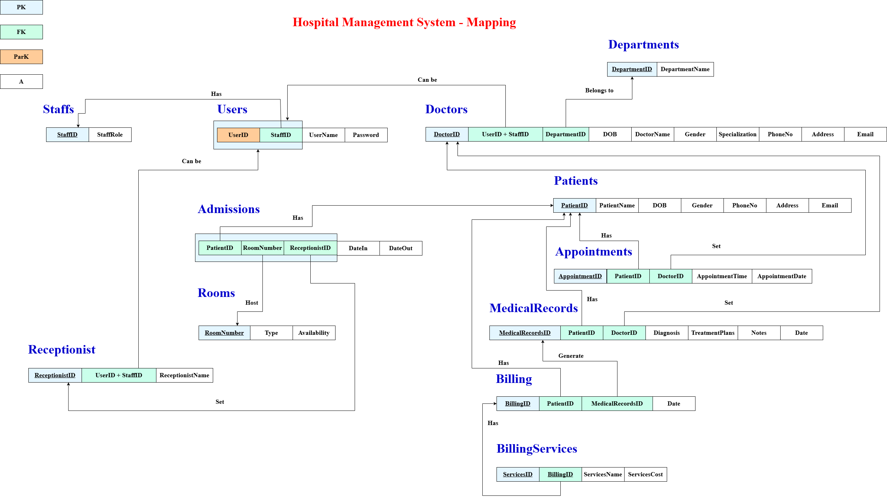

# Required Database Objects 

|Table          |Description                                    |
|---------------|-----------------------------------------------|
|Patients       |name, DOB, gender, contact info                |
|Doctors        |specialization, contact info                   |
|Departments    |cardiology, dermatology, etc.                  |
|Appointments   |Links patients with doctors and a time         |
|Admissions     |For in-patient stays: room number, date in/out | 
|Rooms          |Room number, type (ICU, general), availability |
|MedicalRecords |Diagnosis, treatment plans, date, notes        |
|Billing        |Total cost, patient ID, services, date         |
|Staff          |Nurses, admin: role, shift, assigned dept      |
|Users          |Login credentials: username, password, role    |

## 1. ERD 


## 2. Mapping


## 3. Normalization


# Database Design Requirements 

## 1. DDL (CREATION OF THE TABLE)

```sql
-- Create Hospital Management System database
CREATE DATABASE HospitalManagementSystem;

USE HospitalManagementSystem;

-- Create Staffs table
CREATE TABLE Staffs (
    StaffID INT PRIMARY KEY IDENTITY(1,1),
    StaffRole VARCHAR(100) NOT NULL CHECK (StaffRole IN 
    ('Doctor', 'Receptionist', 'Nurse', 'Pharmacist', 'Technician', 'Surgeon', 'Admin'))
);

--Adding constraint for StaffRole to check if the value entered is vailde or not

-- Create Users table
CREATE TABLE Users (
    --UserID INT PRIMARY KEY IDENTITY(1,1),
	UserID INT IDENTITY(1,1),
    StaffID INT FOREIGN KEY REFERENCES Staffs(StaffID) ON DELETE CASCADE ON UPDATE CASCADE,
    UserName VARCHAR(50) NOT NULL,
    Password VARCHAR(50) NOT NULL,
	PRIMARY KEY(UserID, StaffID)
);

--PRIMARY KEY is a Composite kay 

-- Create Departments table
CREATE TABLE Departments (
    DepartmentID INT PRIMARY KEY IDENTITY(1,1),
    DepartmentName VARCHAR(100) NOT NULL CHECK (DepartmentName IN 
    ('Cardiology', 'Neurology', 'Pediatrics', 'Orthopedics', 'General Surgery', 'Radiology', 'Dermatology'))
);

--Adding constraint for DepartmentName to check if the value entered is vailde or not

-- Create Doctors table
CREATE TABLE Doctors (
    DoctorID INT PRIMARY KEY IDENTITY(1,1),
    UserID INT NOT NULL,
    StaffID INT NOT NULL,
    DepartmentID INT FOREIGN KEY REFERENCES Departments(DepartmentID) ON DELETE SET NULL ON UPDATE NO ACTION,
    DoctorName VARCHAR(50) NOT NULL,
    DOB DATE NOT NULL,
    Gender VARCHAR(10) NOT NULL CHECK (Gender IN ('Male', 'Female')),
    Specialization VARCHAR(255) NOT NULL DEFAULT 'General Practitioner',
    PhoneNo VARCHAR(8) NOT NULL CHECK(LEN(RTRIM(PhoneNo)) = 8),
    Address VARCHAR(255),
    Email VARCHAR(255),

    -- Composite Foreign Key
    CONSTRAINT FK_Doctors_Users FOREIGN KEY (UserID, StaffID)
        REFERENCES Users(UserID, StaffID)
        ON DELETE CASCADE
        ON UPDATE CASCADE
);

--becosue the FK is a Composite PK first I prepare a column to take their value (UserID, StaffID) sparet and then 
-- I add a constraint FK (FK_Doctors_Users) which will brainge the Composite PK together and divided the into 
--(UserID, StaffID) columns

--Adding constraint for Gender, Specialization and PhoneNo to check if the value entered is vailde or not

-- Create Patients table
CREATE TABLE Patients (
    PatientID INT PRIMARY KEY IDENTITY(1,1),
    PatientName VARCHAR(50) NOT NULL,
    DOB DATE NOT NULL,
    Gender VARCHAR(20) NOT NULL,
    PhoneNo VARCHAR(8) CHECK(LEN(RTRIM(PhoneNo)) = 8),
    Address VARCHAR(255),
    Email VARCHAR(255)
);

--Adding constraint for PhoneNo to check if the value entered is vailde or not

-- Create Appointments table
CREATE TABLE Appointments (
    AppointmentID INT PRIMARY KEY IDENTITY(1,1),
    PatientID INT FOREIGN KEY REFERENCES Patients(PatientID)ON DELETE CASCADE ON UPDATE CASCADE,
    DoctorID INT FOREIGN KEY REFERENCES Doctors(DoctorID)ON DELETE NO ACTION ON UPDATE NO ACTION,
    AppointmentTime TIME NOT NULL,
    AppointmentDate DATE NOT NULL
);

-- Create Rooms table
CREATE TABLE Rooms (
    RoomNumber INT PRIMARY KEY,
    Type VARCHAR(50),
    Availability VARCHAR(10) DEFAULT 'TRUE'
);

--Adding constraint for Availability to check if the value entered is vailde or not

-- Create Receptionist table
CREATE TABLE Receptionist (
    ReceptionistID INT PRIMARY KEY IDENTITY(1,1),
    UserID INT NOT NULL,
    StaffID INT NOT NULL,
    ReceptionistName VARCHAR(50), 

	-- Composite Foreign Key
    CONSTRAINT FK_Receptionist_Users FOREIGN KEY (UserID, StaffID)
        REFERENCES Users(UserID, StaffID)
        ON DELETE CASCADE
        ON UPDATE CASCADE
);

-- Create Admissions table
CREATE TABLE Admissions (
    AdmissionID INT PRIMARY KEY IDENTITY(1,1),
    PatientID INT FOREIGN KEY REFERENCES Patients(PatientID) ON DELETE CASCADE ON UPDATE CASCADE,
    RoomNumber INT FOREIGN KEY REFERENCES Rooms(RoomNumber) ON DELETE SET NULL ON UPDATE NO ACTION,
    ReceptionistID INT FOREIGN KEY REFERENCES Receptionist(ReceptionistID) ON DELETE SET NULL ON UPDATE NO ACTION,
    DateIn DATE NOT NULL,
    DateOut DATE
);

-- Create MedicalRecords table
CREATE TABLE MedicalRecords (
    MedicalRecordsID INT PRIMARY KEY IDENTITY(1,1),
    PatientID INT FOREIGN KEY REFERENCES Patients(PatientID) ON DELETE CASCADE ON UPDATE CASCADE,
    DoctorID INT FOREIGN KEY REFERENCES Doctors(DoctorID) ON DELETE NO ACTION ON UPDATE NO ACTION,
    Notes VARCHAR(255) DEFAULT 'No note add',
    Date DATE NOT NULL
);

--Adding constraint for Notes to check if the value entered is vailde or not

-- Create MedicalDiagnoses table
CREATE TABLE MedicalDiagnoses (
    DiagnosisID INT PRIMARY KEY IDENTITY(1,1),
    MedicalRecordsID INT FOREIGN KEY REFERENCES MedicalRecords(MedicalRecordsID) ON DELETE CASCADE ON UPDATE CASCADE,
    Diagnosis VARCHAR(255) DEFAULT 'No diagnosis add'
);

--Adding constraint for Diagnosis to check if the value entered is vailde or not

-- Create MedicalTreatments table
CREATE TABLE MedicalTreatments (
    TreatmentID INT PRIMARY KEY IDENTITY(1,1),
    MedicalRecordsID INT FOREIGN KEY REFERENCES MedicalRecords(MedicalRecordsID) ON DELETE CASCADE ON UPDATE CASCADE,
    TreatmentPlans VARCHAR(255) DEFAULT 'No treatment plans add'
);

--Adding constraint for TreatmentPlans to check if the value entered is vailde or not

-- Create Billing table
CREATE TABLE Billing (
    BillingID INT PRIMARY KEY IDENTITY(1,1),
    PatientID INT FOREIGN KEY REFERENCES Patients(PatientID) ON DELETE CASCADE ON UPDATE CASCADE,
    MedicalRecordsID INT FOREIGN KEY REFERENCES MedicalRecords(MedicalRecordsID)ON DELETE NO ACTION ON UPDATE NO ACTION,
    Date DATE NOT NULL
);

-- Create BillingServices table
CREATE TABLE BillingServices (
    ServicesID INT PRIMARY KEY IDENTITY(1,1),
    BillingID INT FOREIGN KEY REFERENCES Billing(BillingID) ON DELETE CASCADE ON UPDATE CASCADE,
    ServicesName VARCHAR(255) NOT NULL,
    ServicesCost decimal NOT NULL CHECK (ServicesCost > 0)
);

--Adding constraint for ServicesCost to check if the value entered is vailde or not
```

## 2. DML (INSERTION OF THE DATA)

**. Insert into Staffs**
```sql
INSERT INTO Staffs (StaffRole) VALUES 
('Doctor'), ('Receptionist'), ('Nurse'), ('Pharmacist'), ('Technician'), ('Surgeon'), ('Admin');

SELECT * FROM Staffs;
```


**. Insert into Users**
```sql
-- Insert into Users
INSERT INTO Users (StaffID, UserName, Password) VALUES 
(1, 'docjohn', 'pass123'),
(2, 'reception1', 'pass234'),
(3, 'nurse_amy', 'pass345'),
(4, 'pharm_bob', 'pass456'),
(5, 'tech_mike', 'pass567'),
(6, 'surge_linda', 'pass678'),
(7, 'admin_kate', 'pass789');

SELECT * FROM Users;
```


**. Insert into Departments**
```sql
-- Insert into Departments
INSERT INTO Departments (DepartmentName) VALUES 
('Cardiology'), ('Neurology'), ('Pediatrics'), ('Orthopedics'), ('General Surgery'), ('Radiology'), ('Dermatology');

SELECT * FROM Departments;
```


**. Insert into Doctors**
```sql
-- Insert into Doctors
INSERT INTO Doctors (UserID, StaffID, DepartmentID, DoctorName, DOB, Gender, Specialization, PhoneNo, Address, Email) VALUES 
(1, 1, 1, 'Dr. John Smith', '1980-04-12', 'Male', 'Cardiologist', '99887766', '123 Heart St.', 'john@hospital.com'),
(1, 1, 2, 'Dr. Alice Brown', '1975-07-19', 'Female', 'Neurologist', '99887761', '456 Brain Ave.', 'alice@hospital.com'),
(1, 1, 3, 'Dr. Emma White', '1988-09-21', 'Female', 'Pediatrician', '99887762', '789 Kid Ln.', 'emma@hospital.com'),
(1, 1, 4, 'Dr. Noah Black', '1982-12-01', 'Male', 'Orthopedic', '99887763', '321 Bone Blvd.', 'noah@hospital.com'),
(1, 1, 5, 'Dr. Liam Green', '1979-11-17', 'Male', 'Surgeon', '99887764', '654 Cut St.', 'liam@hospital.com'),
(1, 1, 6, 'Dr. Olivia Grey', '1983-06-25', 'Female', 'Radiologist', '99887765', '987 Scan Ave.', 'olivia@hospital.com'),
(1, 1, 7, 'Dr. Mason Blue', '1990-02-28', 'Male', 'Dermatologist', '99887760', '123 Skin Rd.', 'mason@hospital.com');

SELECT * FROM Doctors;
```


**. Insert into Patients**
```sql
-- Insert into Patients
INSERT INTO Patients (PatientName, DOB, Gender, PhoneNo, Address, Email) VALUES 
('James Taylor', '1992-08-15', 'Male', '90909090', '12 Street A', 'james@mail.com'),
('Sophie Turner', '1985-03-22', 'Female', '80808080', '34 Street B', 'sophie@mail.com'),
('William Scott', '1978-06-10', 'Male', '70707070', '56 Street C', 'william@mail.com'),
('Lily Adams', '1990-11-02', 'Female', '60606060', '78 Street D', 'lily@mail.com'),
('Michael Lee', '1982-01-30', 'Male', '50505050', '90 Street E', 'michael@mail.com'),
('Grace Hill', '1995-09-17', 'Female', '40404040', '21 Street F', 'grace@mail.com'),
('Daniel Young', '2000-12-20', 'Male', '30303030', '43 Street G', 'daniel@mail.com');

SELECT * FROM Patients;
```


**. Insert into Appointments**
```sql
-- Insert into Appointments
INSERT INTO Appointments (PatientID, DoctorID, AppointmentTime, AppointmentDate) VALUES 
(1, 1, '09:00', '2025-07-01'),
(2, 2, '10:00', '2025-07-02'),
(3, 3, '11:00', '2025-07-03'),
(4, 4, '12:00', '2025-07-04'),
(5, 5, '13:00', '2025-07-05'),
(6, 6, '14:00', '2025-07-06'),
(7, 7, '15:00', '2025-07-07');

SELECT * FROM Appointments;
```


**. Insert into Rooms**
```sql
-- Insert into Rooms
INSERT INTO Rooms (RoomNumber, Type, Availability) VALUES 
(101, 'ICU', 'TRUE'),
(102, 'General', 'FALSE'),
(103, 'Pediatrics', 'TRUE'),
(104, 'Maternity', 'TRUE'),
(105, 'Surgery', 'FALSE'),
(106, 'Radiology', 'TRUE'),
(107, 'Dermatology', 'TRUE');

SELECT * FROM Rooms;
```


**. Insert into Receptionist**
```sql
-- Insert into Receptionist
INSERT INTO Receptionist (UserID, StaffID, ReceptionistName) VALUES 
(2, 2, 'Sarah'),
(2, 2, 'Anna'),
(2, 2, 'Zara'),
(2, 2, 'Nina'),
(2, 2, 'Emma'),
(2, 2, 'Lana'),
(2, 2, 'Rina');

SELECT * FROM Receptionist;
```


**. Insert into Admissions**
```sql
-- Insert into Admissions
INSERT INTO Admissions (PatientID, RoomNumber, ReceptionistID, DateIn, DateOut) VALUES 
(1, 101, 1, '2025-06-01', '2025-06-05'),
(2, 102, 2, '2025-06-02', '2025-06-06'),
(3, 103, 3, '2025-06-03', '2025-06-07'),
(4, 104, 4, '2025-06-04', '2025-06-08'),
(5, 105, 5, '2025-06-05', '2025-06-09'),
(6, 106, 6, '2025-06-06', '2025-06-10'),
(7, 107, 7, '2025-06-07', '2025-06-11');

SELECT * FROM Admissions;
```


**. Insert into MedicalRecords**
```sql
-- Insert into MedicalRecords
INSERT INTO MedicalRecords (PatientID, DoctorID, Notes, Date) VALUES 
(1, 1, 'Initial checkup', '2025-06-01'),
(2, 2, 'Headache observed', '2025-06-02'),
(3, 3, 'Fever noted', '2025-06-03'),
(4, 4, 'Fracture diagnosis', '2025-06-04'),
(5, 5, 'Surgery recommended', '2025-06-05'),
(6, 6, 'Scan done', '2025-06-06'),
(7, 7, 'Skin rash treated', '2025-06-07');

SELECT * FROM MedicalRecords;
```


**. Insert into MedicalDiagnoses**
```sql
-- Insert into MedicalDiagnoses
INSERT INTO MedicalDiagnoses (MedicalRecordsID, Diagnosis) VALUES 
(1, 'Hypertension'),
(2, 'Migraine'),
(3, 'Flu'),
(4, 'Broken arm'),
(5, 'Appendicitis'),
(6, 'Lung infection'),
(7, 'Eczema');

SELECT * FROM MedicalDiagnoses;
```


**. Insert into MedicalTreatments**
```sql
-- Insert into MedicalTreatments
INSERT INTO MedicalTreatments (MedicalRecordsID, TreatmentPlans) VALUES 
(1, 'Blood pressure meds'),
(2, 'Painkillers'),
(3, 'Rest and fluids'),
(4, 'Cast'),
(5, 'Surgery scheduled'),
(6, 'Antibiotics'),
(7, 'Ointments');

SELECT * FROM MedicalTreatments;
```


**. Insert into Billing**
```sql
-- Insert into Billing
INSERT INTO Billing (PatientID, MedicalRecordsID, Date) VALUES 
(1, 1, '2025-06-01'),
(2, 2, '2025-06-02'),
(3, 3, '2025-06-03'),
(4, 4, '2025-06-04'),
(5, 5, '2025-06-05'),
(6, 6, '2025-06-06'),
(7, 7, '2025-06-07');

SELECT * FROM Billing;
```


**. Insert into BillingServices**
```sql
-- Insert into BillingServices
INSERT INTO BillingServices (BillingID, ServicesName, ServicesCost) VALUES 
(1, 'Checkup', 20.44),
(2, 'MRI', 120),
(3, 'Consultation', 50),
(4, 'X-Ray', 70),
(5, 'Surgery', 500.04),
(6, 'CT Scan', 150),
(7, 'Skin Treatment', 80.489);

SELECT * FROM BillingServices;
```


**Full inseration of the data**
```sql
-- Insert into Staffs
INSERT INTO SystemSchema.Staffs (StaffRole) VALUES 
('Doctor'), ('Receptionist'), ('Nurse'), ('Pharmacist'), ('Technician'), ('Surgeon'), ('Admin');

SELECT * FROM SystemSchema.Staffs;

-- Insert into Users
INSERT INTO SystemSchema.Users (StaffID, UserName, Password) VALUES 
(1, 'docjohn', 'pass123'),
(2, 'reception1', 'pass234'),
(3, 'nurse_amy', 'pass345'),
(4, 'pharm_bob', 'pass456'),
(5, 'tech_mike', 'pass567'),
(6, 'surge_linda', 'pass678'),
(7, 'admin_kate', 'pass789');

-- Add Users
INSERT INTO SystemSchema.Users (StaffID, UserName, Password) VALUES 
(1, 'user10', 'pass10'), (2, 'user11', 'pass11'), (3, 'user12', 'pass12'), 
(4, 'user13', 'pass13'), (5, 'user14', 'pass14'), (6, 'user15', 'pass15'),
(7, 'user16', 'pass16'), (1, 'user17', 'pass17'), (2, 'user18', 'pass18'),
(3, 'user19', 'pass19'), (4, 'user20', 'pass20'), (5, 'user21', 'pass21'),
(6, 'user22', 'pass22'), (7, 'user23', 'pass23'), (1, 'user24', 'pass24'),
(2, 'user25', 'pass25'), (3, 'user26', 'pass26'), (4, 'user27', 'pass27'),
(5, 'user28', 'pass28'), (6, 'user29', 'pass29');


SELECT * FROM SystemSchema.Users;

-- Insert into Departments
INSERT INTO SystemSchema.Departments (DepartmentName) VALUES 
('Cardiology'), ('Neurology'), ('Pediatrics'), ('Orthopedics'), ('General Surgery'), ('Radiology'), ('Dermatology');

SELECT * FROM SystemSchema.Departments;

-- Insert into Doctors
INSERT INTO DoctorsSchema.Doctors (UserID, StaffID, DepartmentID, DoctorName, DOB, Gender, Specialization, PhoneNo, Address, Email) VALUES 
(1, 1, 1, 'Dr. John Smith', '1980-04-12', 'Male', 'Cardiologist', '99887766', '123 Heart St.', 'john@hospital.com'),
(1, 1, 2, 'Dr. Alice Brown', '1975-07-19', 'Female', 'Neurologist', '99887761', '456 Brain Ave.', 'alice@hospital.com'),
(1, 1, 3, 'Dr. Emma White', '1988-09-21', 'Female', 'Pediatrician', '99887762', '789 Kid Ln.', 'emma@hospital.com'),
(1, 1, 4, 'Dr. Noah Black', '1982-12-01', 'Male', 'Orthopedic', '99887763', '321 Bone Blvd.', 'noah@hospital.com'),
(1, 1, 5, 'Dr. Liam Green', '1979-11-17', 'Male', 'Surgeon', '99887764', '654 Cut St.', 'liam@hospital.com'),
(1, 1, 6, 'Dr. Olivia Grey', '1983-06-25', 'Female', 'Radiologist', '99887765', '987 Scan Ave.', 'olivia@hospital.com'),
(1, 1, 7, 'Dr. Mason Blue', '1990-02-28', 'Male', 'Dermatologist', '99887760', '123 Skin Rd.', 'mason@hospital.com');
-- Insert additional Doctors
INSERT INTO DoctorsSchema.Doctors (UserID, StaffID, DepartmentID, DoctorName, DOB, Gender, Specialization, PhoneNo, Address, Email) VALUES
(1, 1, 1, 'Dr. Ethan Reed', '1981-05-20', 'Male', 'Cardiologist', '99887701', '12 Heartway St.', 'ethan.reed@hospital.com'),
(1, 1, 2, 'Dr. Sophia Clark', '1979-08-15', 'Female', 'Neurologist', '99887702', '34 Brainy Rd.', 'sophia.clark@hospital.com'),
(1, 1, 3, 'Dr. Benjamin Hall', '1987-03-10', 'Male', 'Pediatrician', '99887703', '56 Childcare Blvd.', 'ben.hall@hospital.com'),
(1, 1, 4, 'Dr. Mia Lewis', '1985-11-05', 'Female', 'Orthopedic Surgeon', '99887704', '78 Bone St.', 'mia.lewis@hospital.com'),
(1, 1, 5, 'Dr. Lucas Walker', '1983-07-12', 'Male', 'Surgeon', '99887705', '90 Surgery Rd.', 'lucas.walker@hospital.com'),
(1, 1, 6, 'Dr. Ella Harris', '1990-02-28', 'Female', 'Radiologist', '99887706', '21 Imaging Ln.', 'ella.harris@hospital.com'),
(1, 1, 7, 'Dr. Henry Young', '1984-06-18', 'Male', 'Dermatologist', '99887707', '43 Skin St.', 'henry.young@hospital.com'),
(1, 1, 1, 'Dr. Grace King', '1986-09-25', 'Female', 'Cardiologist', '99887708', '65 Heart Blvd.', 'grace.king@hospital.com'),
(1, 1, 2, 'Dr. Daniel Scott', '1982-12-14', 'Male', 'Neurologist', '99887709', '87 Brainy Ave.', 'daniel.scott@hospital.com'),
(1, 1, 3, 'Dr. Lily Adams', '1991-01-22', 'Female', 'Pediatrician', '99887710', '109 Kids St.', 'lily.adams@hospital.com'),
(1, 1, 4, 'Dr. Samuel Baker', '1980-04-05', 'Male', 'Orthopedic Surgeon', '99887711', '131 Bones Blvd.', 'samuel.baker@hospital.com'),
(1, 1, 5, 'Dr. Chloe Carter', '1988-07-16', 'Female', 'Surgeon', '99887712', '153 Surgery Way', 'chloe.carter@hospital.com'),
(1, 1, 6, 'Dr. Jack Morris', '1977-11-29', 'Male', 'Radiologist', '99887713', '175 Scan Rd.', 'jack.morris@hospital.com'),
(1, 1, 7, 'Dr. Emily Perez', '1989-03-03', 'Female', 'Dermatologist', '99887714', '197 Skin Blvd.', 'emily.perez@hospital.com'),
(1, 1, 1, 'Dr. Oliver Ward', '1992-05-25', 'Male', 'Cardiologist', '99887715', '219 Heart St.', 'oliver.ward@hospital.com'),
(1, 1, 2, 'Dr. Ava Bennett', '1990-09-09', 'Female', 'Neurologist', '99887716', '241 Brainy Ave.', 'ava.bennett@hospital.com'),
(1, 1, 3, 'Dr. William Cooper', '1981-08-01', 'Male', 'Pediatrician', '99887717', '263 Kids Rd.', 'william.cooper@hospital.com'),
(1, 1, 4, 'Dr. Harper Rivera', '1984-10-30', 'Female', 'Orthopedic Surgeon', '99887718', '285 Bones St.', 'harper.rivera@hospital.com'),
(1, 1, 5, 'Dr. James Bailey', '1979-02-14', 'Male', 'Surgeon', '99887719', '307 Surgery Ln.', 'james.bailey@hospital.com'),
(1, 1, 6, 'Dr. Isabella Brooks', '1987-06-20', 'Female', 'Radiologist', '99887720', '329 Imaging Blvd.', 'isabella.brooks@hospital.com');


SELECT * FROM DoctorsSchema.Doctors;

-- Insert into Patients
INSERT INTO PatientsSchema.Patients (PatientName, DOB, Gender, PhoneNo, Address, Email) VALUES 
('James Taylor', '1992-08-15', 'Male', '90909090', '12 Street A', 'james@mail.com'),
('Sophie Turner', '1985-03-22', 'Female', '80808080', '34 Street B', 'sophie@mail.com'),
('William Scott', '1978-06-10', 'Male', '70707070', '56 Street C', 'william@mail.com'),
('Lily Adams', '1990-11-02', 'Female', '60606060', '78 Street D', 'lily@mail.com'),
('Michael Lee', '1982-01-30', 'Male', '50505050', '90 Street E', 'michael@mail.com'),
('Grace Hill', '1995-09-17', 'Female', '40404040', '21 Street F', 'grace@mail.com'),
('Daniel Young', '2000-12-20', 'Male', '30303030', '43 Street G', 'daniel@mail.com');

-- Insert additional 15 Patients
INSERT INTO PatientsSchema.Patients (PatientName, DOB, Gender, PhoneNo, Address, Email) VALUES
('Aisha Ahmed', '1993-03-10', 'Female', '91234501', '10 Green St.', 'aisha@mail.com'),
('Omar Khalid', '1988-07-22', 'Male', '91234502', '20 Blue St.', 'omar@mail.com'),
('Fatima Salim', '1990-05-15', 'Female', '91234503', '30 Red St.', 'fatima@mail.com'),
('Hassan Ali', '1985-09-05', 'Male', '91234504', '40 Yellow St.', 'hassan@mail.com'),
('Noor Saeed', '1997-12-18', 'Female', '91234505', '50 White St.', 'noor@mail.com'),
('Salim Nasser', '1991-04-30', 'Male', '91234506', '60 Black St.', 'salim@mail.com'),
('Layla Mohammed', '1984-11-25', 'Female', '91234507', '70 Silver St.', 'layla@mail.com'),
('Yusuf Hassan', '1989-01-13', 'Male', '91234508', '80 Golden St.', 'yusuf@mail.com'),
('Maya Hamad', '1996-02-09', 'Female', '91234509', '90 Purple St.', 'maya@mail.com'),
('Ali Zayed', '1987-06-21', 'Male', '91234510', '100 Brown St.', 'ali@mail.com'),
('Rania Fadel', '1994-08-03', 'Female', '91234511', '110 Orange St.', 'rania@mail.com'),
('Tariq Yousef', '1982-10-17', 'Male', '91234512', '120 Pink St.', 'tariq@mail.com'),
('Sara Sami', '1995-05-27', 'Female', '91234513', '130 Gray St.', 'sara@mail.com'),
('Adnan Khalifa', '1980-02-14', 'Male', '91234514', '140 Teal St.', 'adnan@mail.com'),
('Huda Majid', '1992-09-19', 'Female', '91234515', '150 Cyan St.', 'huda@mail.com');

SELECT * FROM PatientsSchema.Patients;

-- Insert into Appointments
INSERT INTO DoctorsSchema.Appointments (PatientID, DoctorID, AppointmentTime, AppointmentDate) VALUES 
(1, 1, '09:00', '2025-07-01'),
(2, 2, '10:00', '2025-07-02'),
(3, 3, '11:00', '2025-07-03'),
(4, 4, '12:00', '2025-07-04'),
(5, 5, '13:00', '2025-07-05'),
(6, 6, '14:00', '2025-07-06'),
(7, 7, '15:00', '2025-07-07');

-- Insert additional Appointments (DoctorID = 1 has 5 records)
INSERT INTO DoctorsSchema.Appointments (PatientID, DoctorID, AppointmentTime, AppointmentDate) VALUES
(1, 1, '09:30', '2025-07-08'),  -- Doctor 1
(2, 1, '10:15', '2025-07-09'),  -- Doctor 1
(3, 1, '11:45', '2025-07-10'),  -- Doctor 1
(4, 1, '12:30', '2025-07-11'),  -- Doctor 1
(5, 1, '13:15', '2025-07-12'),  -- Doctor 1
(6, 2, '14:00', '2025-07-13'),
(7, 3, '15:30', '2025-07-14'),
(1, 3, '09:00', '2025-08-01'),
(2, 4, '10:30', '2025-08-02'),
(3, 5, '11:00', '2025-08-03'),
(4, 6, '12:15', '2025-08-04'),
(5, 7, '13:45', '2025-08-05'),
(6, 2, '14:30', '2025-08-06'),
(7, 3, '15:00', '2025-08-07'),
(1, 4, '09:15', '2025-09-01'),
(2, 5, '10:45', '2025-09-02'),
(3, 6, '11:30', '2025-09-03'),
(4, 7, '12:45', '2025-09-04'),
(5, 2, '13:30', '2025-09-05'),
(6, 3, '14:15', '2025-09-06');


SELECT * FROM DoctorsSchema.Appointments;

-- Insert into Rooms
INSERT INTO ReceptionistSchema.Rooms (RoomNumber, Type, Availability) VALUES 
(101, 'ICU', 'TRUE'),
(102, 'General', 'FALSE'),
(103, 'Pediatrics', 'TRUE'),
(104, 'Maternity', 'TRUE'),
(105, 'Surgery', 'FALSE'),
(106, 'Radiology', 'TRUE'),
(107, 'Dermatology', 'TRUE');

-- Insert additional 15 Rooms
INSERT INTO ReceptionistSchema.Rooms (RoomNumber, Type, Availability) VALUES
(108, 'ICU', 'TRUE'),
(109, 'General', 'TRUE'),
(110, 'Pediatrics', 'FALSE'),
(111, 'Maternity', 'TRUE'),
(112, 'Surgery', 'FALSE'),
(113, 'Radiology', 'TRUE'),
(114, 'Dermatology', 'TRUE'),
(115, 'ICU', 'FALSE'),
(116, 'General', 'TRUE'),
(117, 'Pediatrics', 'TRUE'),
(118, 'Maternity', 'FALSE'),
(119, 'Surgery', 'TRUE'),
(120, 'Radiology', 'FALSE'),
(121, 'Dermatology', 'TRUE'),
(122, 'ICU', 'TRUE');


SELECT * FROM ReceptionistSchema.Rooms;

-- Insert into Receptionist
INSERT INTO ReceptionistSchema.Receptionist (UserID, StaffID, ReceptionistName) VALUES 
(2, 2, 'Sarah'),
(2, 2, 'Anna'),
(2, 2, 'Zara'),
(2, 2, 'Nina'),
(2, 2, 'Emma'),
(2, 2, 'Lana'),
(2, 2, 'Rina');

INSERT INTO ReceptionistSchema.Receptionist (UserID, StaffID, ReceptionistName) VALUES 
(2, 2, 'Laila'),
(2, 2, 'Amina'),
(2, 2, 'Khadija'),
(2, 2, 'Rashid'),
(2, 2, 'Mohammed'),
(2, 2, 'Yasmin'),
(2, 2, 'Hassan'),
(2, 2, 'Fatima'),
(2, 2, 'Salim'),
(2, 2, 'Omar'),
(2, 2, 'Noura'),
(2, 2, 'Aliya'),
(2, 2, 'Zainab'),
(2, 2, 'Khalid'),
(2, 2, 'Sara');


SELECT * FROM ReceptionistSchema.Receptionist;

-- Insert into Admissions
INSERT INTO ReceptionistSchema.Admissions (PatientID, RoomNumber, ReceptionistID, DateIn, DateOut) VALUES 
(1, 101, 1, '2025-06-01', '2025-06-05'),
(2, 102, 2, '2025-06-02', '2025-06-06'),
(3, 103, 3, '2025-06-03', '2025-06-07'),
(4, 104, 4, '2025-06-04', '2025-06-08'),
(5, 105, 5, '2025-06-05', '2025-06-09'),
(6, 106, 6, '2025-06-06', '2025-06-10'),
(7, 107, 7, '2025-06-07', '2025-06-11');

INSERT INTO ReceptionistSchema.Admissions (PatientID, RoomNumber, ReceptionistID, DateIn, DateOut) VALUES 
(1, 108, 8, '2025-07-01', '2025-07-05'),
(2, 109, 9, '2025-07-02', '2025-07-06'),
(3, 110, 10, '2025-07-03', '2025-07-07'),
(4, 111, 11, '2025-07-04', '2025-07-08'),
(5, 112, 12, '2025-07-05', '2025-07-09'),
(6, 113, 13, '2025-07-06', '2025-07-10'),
(7, 114, 14, '2025-07-07', '2025-07-11'),
(1, 115, 15, '2025-07-08', '2025-07-12'),
(2, 116, 1, '2025-07-09', '2025-07-13'),
(3, 117, 2, '2025-07-10', '2025-07-14'),
(4, 118, 3, '2025-07-11', '2025-07-15'),
(5, 119, 4, '2025-07-12', '2025-07-16'),
(6, 120, 5, '2025-07-13', '2025-07-17'),
(7, 121, 6, '2025-07-14', '2025-07-18'),
(1, 122, 7, '2025-07-15', '2025-07-19');


SELECT * FROM ReceptionistSchema.Admissions;

-- Insert into MedicalRecords
INSERT INTO DoctorsSchema.MedicalRecords (PatientID, DoctorID, Notes, Date) VALUES 
(1, 1, 'Initial checkup', '2025-06-01'),
(2, 2, 'Headache observed', '2025-06-02'),
(3, 3, 'Fever noted', '2025-06-03'),
(4, 4, 'Fracture diagnosis', '2025-06-04'),
(5, 5, 'Surgery recommended', '2025-06-05'),
(6, 6, 'Scan done', '2025-06-06'),
(7, 7, 'Skin rash treated', '2025-06-07');

INSERT INTO DoctorsSchema.MedicalRecords (PatientID, DoctorID, Notes, Date) VALUES 
(1, 2, 'Follow-up visit', '2025-07-01'),
(2, 3, 'Routine checkup', '2025-07-02'),
(3, 4, 'Post-surgery review', '2025-07-03'),
(4, 5, 'Pain management consultation', '2025-07-04'),
(5, 6, 'X-ray analysis', '2025-07-05'),
(6, 7, 'Dermatology consultation', '2025-07-06'),
(7, 1, 'Blood pressure review', '2025-07-07'),
(1, 2, 'Migraine follow-up', '2025-07-08'),
(2, 3, 'Pediatric fever', '2025-07-09'),
(3, 4, 'Fracture healing review', '2025-07-10'),
(4, 5, 'Surgery wound check', '2025-07-11'),
(5, 6, 'CT scan evaluation', '2025-07-12'),
(6, 7, 'Skin allergy review', '2025-07-13'),
(7, 1, 'General health check', '2025-07-14'),
(1, 2, 'Neurology assessment', '2025-07-15');

SELECT * FROM DoctorsSchema.MedicalRecords;

-- Insert into MedicalDiagnoses
INSERT INTO DoctorsSchema.MedicalDiagnoses (MedicalRecordsID, Diagnosis) VALUES 
(1, 'Hypertension'),
(2, 'Migraine'),
(3, 'Flu'),
(4, 'Broken arm'),
(5, 'Appendicitis'),
(6, 'Lung infection'),
(7, 'Eczema');

INSERT INTO DoctorsSchema.MedicalDiagnoses (MedicalRecordsID, Diagnosis) VALUES 
(8, 'Stable condition'),
(9, 'Healthy child'),
(10, 'Post-operative recovery'),
(11, 'Chronic pain'),
(12, 'Normal scan'),
(13, 'Skin irritation'),
(14, 'Blood pressure controlled'),
(15, 'Migraine improving'),
(16, 'Child recovering from flu'),
(17, 'Bone healing well'),
(18, 'Surgical site clean'),
(19, 'Clear CT results'),
(20, 'Allergy subsiding'),
(21, 'No major issues'),
(22, 'Mild neurological symptoms');

SELECT * FROM DoctorsSchema.MedicalDiagnoses;

-- Insert into MedicalTreatments
INSERT INTO DoctorsSchema.MedicalTreatments (MedicalRecordsID, TreatmentPlans) VALUES 
(1, 'Blood pressure meds'),
(2, 'Painkillers'),
(3, 'Rest and fluids'),
(4, 'Cast'),
(5, 'Surgery scheduled'),
(6, 'Antibiotics'),
(7, 'Ointments');

INSERT INTO DoctorsSchema.MedicalTreatments (MedicalRecordsID, TreatmentPlans) VALUES 
(8, 'Continue medication'),
(9, 'No treatment needed'),
(10, 'Physical therapy'),
(11, 'Pain management plan'),
(12, 'Observation only'),
(13, 'Skin ointments prescribed'),
(14, 'Regular monitoring'),
(15, 'Painkillers as needed'),
(16, 'Antibiotics for child'),
(17, 'Bone strengthening exercises'),
(18, 'Wound dressing changes'),
(19, 'Routine follow-up'),
(20, 'Allergy medication'),
(21, 'Healthy lifestyle advised'),
(22, 'Neurology follow-up');

SELECT * FROM DoctorsSchema.MedicalTreatments;

-- Insert into Billing
INSERT INTO PatientsSchema.Billing (PatientID, MedicalRecordsID, Date) VALUES 
(1, 1, '2025-06-01'),
(2, 2, '2025-06-02'),
(3, 3, '2025-06-03'),
(4, 4, '2025-06-04'),
(5, 5, '2025-06-05'),
(6, 6, '2025-06-06'),
(7, 7, '2025-06-07');

INSERT INTO PatientsSchema.Billing (PatientID, MedicalRecordsID, Date) VALUES 
(1, 8, '2025-07-01'),
(2, 9, '2025-07-02'),
(3, 10, '2025-07-03'),
(4, 11, '2025-07-04'),
(5, 12, '2025-07-05'),
(6, 13, '2025-07-06'),
(7, 14, '2025-07-07'),
(1, 15, '2025-07-08'),
(2, 16, '2025-07-09'),
(3, 17, '2025-07-10'),
(4, 18, '2025-07-11'),
(5, 19, '2025-07-12'),
(6, 20, '2025-07-13'),
(7, 21, '2025-07-14'),
(1, 22, '2025-07-15');

SELECT * FROM PatientsSchema.Billing;

-- Insert into BillingServices
INSERT INTO PatientsSchema.BillingServices (BillingID, ServicesName, ServicesCost) VALUES 
(1, 'Checkup', 20.44),
(2, 'MRI', 120),
(3, 'Consultation', 50),
(4, 'X-Ray', 70),
(5, 'Surgery', 500.04),
(6, 'CT Scan', 150),
(7, 'Skin Treatment', 80.489);

INSERT INTO PatientsSchema.BillingServices (BillingID, ServicesName, ServicesCost) VALUES 
(8, 'Follow-up Consultation', 30),
(9, 'Routine Checkup', 25),
(10, 'Post-Surgery Visit', 70),
(11, 'Pain Management', 50),
(12, 'X-Ray Service', 90),
(13, 'Skin Consultation', 40),
(14, 'Blood Pressure Check', 20),
(15, 'Migraine Treatment', 60),
(16, 'Pediatric Consultation', 45),
(17, 'Fracture Review', 80),
(18, 'Wound Dressing', 35),
(19, 'CT Scan Evaluation', 150),
(20, 'Allergy Test', 55),
(21, 'General Health Check', 50),
(22, 'Neurology Consultation', 100);

SELECT * FROM PatientsSchema.BillingServices;
```

## 3.  Relational Schema

```sql
--SystemSchema
CREATE SCHEMA SystemSchema;

ALTER SCHEMA SystemSchema TRANSFER Staffs;  
ALTER SCHEMA SystemSchema TRANSFER Users;
ALTER SCHEMA SystemSchema TRANSFER Departments;

--DoctorsSchema
CREATE SCHEMA DoctorsSchema;

ALTER SCHEMA DoctorsSchema TRANSFER Doctors;  
ALTER SCHEMA DoctorsSchema TRANSFER Appointments;
ALTER SCHEMA DoctorsSchema TRANSFER MedicalRecords;
ALTER SCHEMA DoctorsSchema TRANSFER MedicalDiagnoses;
ALTER SCHEMA DoctorsSchema TRANSFER MedicalTreatments;

--PatientsSchema
CREATE SCHEMA PatientsSchema;

ALTER SCHEMA PatientsSchema TRANSFER Patients;  
ALTER SCHEMA PatientsSchema TRANSFER Billing;
ALTER SCHEMA PatientsSchema TRANSFER BillingServices;

--ReceptionistSchema
CREATE SCHEMA ReceptionistSchema;

ALTER SCHEMA ReceptionistSchema TRANSFER Receptionist;  
ALTER SCHEMA ReceptionistSchema TRANSFER Rooms;
ALTER SCHEMA ReceptionistSchema TRANSFER Admissions;
```

# Queries to Test (DQL) 

Require students to write SQL queries for: 

## 1. List all patients who visited a certain doctor. 
```sql
SELECT * FROM DoctorsSchema.Doctors;
SELECT * FROM PatientsSchema.Patients;
SELECT * FROM DoctorsSchema.Appointments;

SELECT P.* 
FROM PatientsSchema.Patients P LEFT OUTER JOIN DoctorsSchema.Appointments A ON P.PatientID = A.PatientID
INNER JOIN DoctorsSchema.Doctors D ON D.DoctorID = A.DoctorID
WHERE D.DoctorName = 'Dr. John Smith';
```


## 2. Count of appointments per department. 
```sql
SELECT * FROM DoctorsSchema.Doctors;
SELECT * FROM DoctorsSchema.Appointments;
SELECT * FROM SystemSchema.Departments;

SELECT DEP.DepartmentName AS 'Department Name', COUNT(A.DoctorID) AS 'Number Of Appointments'
FROM DoctorsSchema.Doctors DO INNER JOIN DoctorsSchema.Appointments A ON DO.DoctorID = A.DoctorID
RIGHT OUTER JOIN SystemSchema.Departments DEP ON DEP.DepartmentID = DO.DoctorID
GROUP BY DEP.DepartmentName;
```


## 3. Retrieve doctors who have more than 5 appointments in a month. 
```sql
SELECT * FROM DoctorsSchema.Doctors;
SELECT * FROM DoctorsSchema.Appointments;

SELECT D.DoctorName AS 'Doctor Name', COUNT(A.DoctorID) AS 'Number Of Appointments'
FROM DoctorsSchema.Doctors D INNER JOIN DoctorsSchema.Appointments A ON D.DoctorID = A.DoctorID
WHERE MONTH(A.AppointmentDate) IN (7, 8, 9)
GROUP BY D.DoctorName
HAVING COUNT(A.DoctorID) > 5;
```


## 4. Use JOINs across 3–4 tables. 
```sql
--select all doctors with all appointment details and patients details
SELECT * FROM DoctorsSchema.Doctors;
SELECT * FROM DoctorsSchema.Appointments;
SELECT * FROM PatientsSchema.Patients;

SELECT D.DoctorID AS 'Doctor ID', D.DoctorName AS 'Doctor Name', P.PatientName AS 'PatientName', A.AppointmentDate AS 'Appointment Date'
FROM DoctorsSchema.Doctors D INNER JOIN DoctorsSchema.Appointments A ON D.DoctorID = A.DoctorID
INNER JOIN PatientsSchema.Patients P ON P.PatientID = A.PatientID
GROUP BY D.DoctorID, D.DoctorName, P.PatientName, A.AppointmentDate;
```


## 5. Use GROUP BY, HAVING, and aggregate functions. 
```sql
-- select all doctors in each departmenet where doctor count more than 1.
SELECT * FROM DoctorsSchema.Doctors;

SELECT D.DepartmentID AS 'Department ID', COUNT(D.DoctorName) AS 'Number Of Doctor'
FROM DoctorsSchema.Doctors D
GROUP BY D.DepartmentID
HAVING COUNT(D.DoctorName) > 1;
```


## 6. Use SUBQUERIES and EXISTS. 
```sql
--select all doctors who treat more than 5 patients
SELECT * FROM DoctorsSchema.Doctors;
SELECT * FROM DoctorsSchema.Appointments;

SELECT D.DoctorID as 'Doctor ID', D.DoctorName AS 'Doctor Name' 
FROM DoctorsSchema.Doctors D INNER JOIN DoctorsSchema.Appointments A ON D.DoctorID = A.DoctorID
WHERE EXISTS (
SELECT D.DoctorID  
FROM DoctorsSchema.Doctors D
)
GROUP BY  D.DoctorID, D.DoctorName
HAVING COUNT(A.PatientID) > 5;
```


# Functions & Stored Procedures 

## 1. Scalar function to calculate patient age from DOB. 
```sql
CREATE FUNCTION dbo.CalculateAge (@DOB DATE)
RETURNS INT
AS
BEGIN
    DECLARE @Age INT;
    SET @Age = DATEDIFF(YEAR, @DOB, GETDATE());

    -- Adjust if birthday hasn't occurred this year yet
    IF (MONTH(@DOB) > MONTH(GETDATE())) OR 
       (MONTH(@DOB) = MONTH(GETDATE()) AND DAY(@DOB) > DAY(GETDATE()))
       SET @Age = @Age - 1;

    RETURN @Age;
END;

--to call dbo.CalculateAge (@DOB DATE)
SELECT PatientName, dbo.CalculateAge(DOB) AS Age FROM PatientsSchema.Patients;
```


## 2. Stored procedure to admit a patient (insert to Admissions, update Room availability). 
```sql
CREATE PROCEDURE AdmitPatient
    @PatientID INT,
    @RoomNumber INT,
    @ReceptionistID INT,
    @DateIn DATE,
    @DateOut DATE = NULL
AS
BEGIN
    BEGIN TRANSACTION;

    -- Insert new admission record
    INSERT INTO ReceptionistSchema.Admissions (PatientID, RoomNumber, ReceptionistID, DateIn, DateOut)
    VALUES (@PatientID, @RoomNumber, @ReceptionistID, @DateIn, @DateOut);

    -- Update room availability to FALSE (occupied)
    UPDATE ReceptionistSchema.Rooms
    SET Availability = 'FALSE'
    WHERE RoomNumber = @RoomNumber;

    COMMIT TRANSACTION;
END;

--to call PROCEDURE AdmitPatient 
EXEC AdmitPatient @PatientID = 1, @RoomNumber = 103, @ReceptionistID = 2, @DateIn = '2025-07-01';


--DROP PROCEDURE AdmitPatient;
```

## 3. Procedure to generate invoice (insert into Billing based on treatments). 
```sql
CREATE PROCEDURE GenerateInvoice
    @PatientID INT,
    @MedicalRecordsID INT,
    @BillingDate DATE
AS
BEGIN
    BEGIN TRANSACTION;

    -- insert new billing record to PatientsSchema.Billing
    INSERT INTO PatientsSchema.Billing (PatientID, MedicalRecordsID, Date)
    VALUES (@PatientID, @MedicalRecordsID, @BillingDate);

    DECLARE @BillingID INT = SCOPE_IDENTITY();
	--SCOPE_IDENTITY(); is a system function in SQL Server that returns the last identity value generated in the current scope

    -- insert services based on treatments to PatientsSchema.BillingServices
    INSERT INTO PatientsSchema.BillingServices (BillingID, ServicesName, ServicesCost)
    SELECT 
        @BillingID,
        TreatmentPlans, --ServicesName = TreatmentPlans
        -- to get TreatmentPlans from DoctorsSchema.MedicalTreatments using join
        CASE 
		-- if ServicesName = '' then ServicesCost = ''
            WHEN TreatmentPlans = 'Surgery scheduled' THEN 500.00
            WHEN TreatmentPlans = 'Antibiotics' THEN 150.00
            WHEN TreatmentPlans = 'Blood pressure meds' THEN 80.00
            WHEN TreatmentPlans = 'Painkillers' THEN 50.00
            WHEN TreatmentPlans = 'Rest and fluids' THEN 30.00
            WHEN TreatmentPlans = 'Cast' THEN 120.00
            WHEN TreatmentPlans = 'Ointments' THEN 60.00
            ELSE 100.00 -- default cost
        END
    FROM DoctorsSchema.MedicalTreatments
    WHERE MedicalRecordsID = @MedicalRecordsID;

    COMMIT TRANSACTION;
END;

--to call PROCEDURE GenerateInvoice
EXEC GenerateInvoice @PatientID = 3, @MedicalRecordsID = 3, @BillingDate = '2025-07-01';
```

## 4. Procedure to assign doctor to department and shift. 
```sql
--becouse I do not have shift column in my table I need to add it first 
--4.1. Alter table to add shift
ALTER TABLE DoctorsSchema.Doctors
ADD Shift VARCHAR(20) DEFAULT 'Morning';

--4.2. Create procedure to update department and shift
CREATE PROCEDURE AssignDoctorToDepartmentAndShift
    @DoctorID INT,
    @DepartmentID INT,
    @Shift VARCHAR(20)
AS
BEGIN
    UPDATE DoctorsSchema.Doctors
    SET DepartmentID = @DepartmentID,
        Shift = @Shift
    WHERE DoctorID = @DoctorID;
END;

--to call PROCEDURE AssignDoctorToDepartmentAndShift
EXEC AssignDoctorToDepartmentAndShift @DoctorID = 1, @DepartmentID = 3, @Shift = 'Evening';

SELECT * FROM DoctorsSchema.Doctors;

--DROP PROCEDURE AssignDoctorToDepartmentAndShift;
```
](./Images/_AssignDoctorToDepartmentAndShift.png)

# Triggers 

## 1. After insert on Appointments → auto log in MedicalRecords. 
```sql
CREATE TRIGGER trg_AfterInsert_Appointment
ON DoctorsSchema.Appointments
AFTER INSERT
--Start of the trigger body
AS
BEGIN
    -- Insert automatically into MedicalRecords for each new appointment
    INSERT INTO DoctorsSchema.MedicalRecords (PatientID, DoctorID, Notes, Date)
    SELECT 
        PatientID, 
        DoctorID, 
        'Auto-created from appointment', 
        CAST(GETDATE() AS DATE)
    FROM inserted;
END;

--to test TRIGGER trg_AfterInsert_Appointment
INSERT INTO DoctorsSchema.Appointments (PatientID, DoctorID, AppointmentTime, AppointmentDate) VALUES 
(1, 1, '09:00', '2025-08-01');

SELECT * FROM DoctorsSchema.Appointments WHERE AppointmentDate = '2025-08-01';
SELECT * FROM DoctorsSchema.MedicalRecords;

--DROP TRIGGER trg_AfterInsert_Appointment;
```


## 2. Before delete on Patients → prevent deletion if pending bills exist. 
```sql
--in sql server we have something call INSTEAD OF DELETE trigger which used to intercept and conditionally prevent deletion.
CREATE TRIGGER trg_BeforeDelete_Patient
ON PatientsSchema.Patients
INSTEAD OF DELETE --This type of trigger intercepts the delete operation and decides whether to allow it or block it
--Start of the trigger body
AS
BEGIN
    IF EXISTS (
        SELECT 1 -- A dummy value. We use SELECT 1 because we don’t need actual data, just to know if something exists
        FROM PatientsSchema.Billing B
        WHERE B.PatientID IN (SELECT PatientID FROM deleted) -- deleted is a special table holding the rows targeted for deletion.
    )
    BEGIN
        -- stop deletion if bills exist
        --RAISERROR -> Displays an error message and stops the process.
        RAISERROR ('Cannot delete patient with pending bills.', 16, 1);
        ROLLBACK TRANSACTION;
    END
    ELSE
    BEGIN
        -- If no bills, allow deletion
        DELETE FROM PatientsSchema.Patients
        WHERE PatientID IN (SELECT PatientID FROM deleted);
    END
END;

--to test TRIGGER trg_BeforeDelete_Patient
--get patients having billing records
SELECT B.BillingID, B.PatientID, P.PatientName
FROM PatientsSchema.Billing B
JOIN PatientsSchema.Patients P ON B.PatientID = P.PatientID;

--try to delete patients with PatientID 1
DELETE FROM PatientsSchema.Patients
WHERE PatientID = 1;
```


## 3. After update on Rooms → ensure no two patients occupy same room. 
```sql
CREATE TRIGGER trg_AfterUpdateRooms3
ON ReceptionistSchema.Admissions
AFTER UPDATE
--Start of the trigger body
AS
BEGIN
    IF EXISTS (
        SELECT RoomNumber
        FROM ReceptionistSchema.Rooms
		WHERE Availability = 'TRUE'
        GROUP BY RoomNumber
        --HAVING COUNT(*) > 1
    )
    BEGIN
        -- If room has more than one patient, block the update
        RAISERROR ('Room conflict detected: Multiple patients assigned to the same room.', 16, 1);
        ROLLBACK TRANSACTION;
    END
END;

--DROP TRIGGER trg_AfterUpdateRooms;


--to test TRIGGER trg_AfterUpdate_Rooms
--1. get all room with the number of Patients assign to it 
SELECT RoomNumber, COUNT(*) AS PatientCount
FROM ReceptionistSchema.Admissions
GROUP BY RoomNumber;

--2. try to update (enter new Patients ... becouse the not change but Patients will) a new Patients in a room which a assigned Patients
-- Example: Assign patient 3 to Room 101 which already has patient 1.
UPDATE ReceptionistSchema.Admissions
SET RoomNumber = 101
WHERE PatientID = 3;

SELECT * FROM ReceptionistSchema.Rooms;
SELECT * FROM ReceptionistSchema.Admissions;
```


# Security (DCL) 

## 1. Create at least two user roles: DoctorUser, AdminUser. 
```sql
-- to create role for DoctorUser and AdminUser
CREATE ROLE DoctorUser;
CREATE ROLE AdminUser;
```

## 2. GRANT SELECT for DoctorUser on Patients and Appointments only. 
```sql
-- Grant SELECT on Patients and Appointments
GRANT SELECT ON PatientsSchema.Patients TO DoctorUser;
GRANT SELECT ON DoctorsSchema.Appointments TO DoctorUser;
```

## 3. GRANT INSERT, UPDATE for AdminUser on all tables. 
```sql
-- SystemSchema
GRANT INSERT, UPDATE ON SystemSchema.Staffs TO AdminUser;
GRANT INSERT, UPDATE ON SystemSchema.Users TO AdminUser;
GRANT INSERT, UPDATE ON SystemSchema.Departments TO AdminUser;

-- DoctorsSchema
GRANT INSERT, UPDATE ON DoctorsSchema.Doctors TO AdminUser;
GRANT INSERT, UPDATE ON DoctorsSchema.Appointments TO AdminUser;
GRANT INSERT, UPDATE ON DoctorsSchema.MedicalRecords TO AdminUser;
GRANT INSERT, UPDATE ON DoctorsSchema.MedicalDiagnoses TO AdminUser;
GRANT INSERT, UPDATE ON DoctorsSchema.MedicalTreatments TO AdminUser;

-- PatientsSchema
GRANT INSERT, UPDATE ON PatientsSchema.Patients TO AdminUser;
GRANT INSERT, UPDATE ON PatientsSchema.Billing TO AdminUser;
GRANT INSERT, UPDATE ON PatientsSchema.BillingServices TO AdminUser;

-- ReceptionistSchema
GRANT INSERT, UPDATE ON ReceptionistSchema.Receptionist TO AdminUser;
GRANT INSERT, UPDATE ON ReceptionistSchema.Rooms TO AdminUser;
GRANT INSERT, UPDATE ON ReceptionistSchema.Admissions TO AdminUser;
```

## 4.REVOKE DELETE for Doctors. 
```sql
--I do not give Doctors permission to delete so first I have to give it to him then do REVOKE
GRANT DELETE ON DoctorsSchema.Appointments TO DoctorUser;

REVOKE DELETE ON DoctorsSchema.Appointments FROM DoctorUser;
```
**To check if the permission is revoked**


# Transactions (TCL) 
```sql
--• Simulate a transaction: admit a patient → insert record, update room, create billing → commit. 
--• Add rollback logic in case of failure. 

BEGIN TRY
    BEGIN TRANSACTION;

    --insert admission
    INSERT INTO ReceptionistSchema.Admissions (PatientID, RoomNumber, ReceptionistID, DateIn)
    VALUES (1, 3, 1, GETDATE());

    --update room availability to 'FALSE' (occupied)
    UPDATE ReceptionistSchema.Rooms
    SET Availability = 'FALSE'
    WHERE RoomNumber = 3;

    --insert billing record
    INSERT INTO PatientsSchema.Billing (PatientID, MedicalRecordsID, Date)
    VALUES (1, 1, GETDATE());  -- Assuming MedicalRecordsID = 1 (for simulation)

    --commit the transaction if all succeed
    COMMIT TRANSACTION;

    PRINT 'Transaction completed successfully.';

END TRY
BEGIN CATCH
    -- rollback in case of any error
    ROLLBACK TRANSACTION;--it show where it is stoped

    PRINT 'Transaction failed. Rolling back...';
    PRINT ERROR_MESSAGE();
END CATCH
```


# Views 

## 1. vw_DoctorSchedule: Upcoming appointments per doctor. 
```sql
CREATE VIEW vw_DoctorSchedule AS
SELECT 
    D.DoctorID,
    D.DoctorName,
    A.AppointmentDate,
    A.AppointmentTime,
    P.PatientName
FROM DoctorsSchema.Doctors D
JOIN DoctorsSchema.Appointments A ON D.DoctorID = A.DoctorID
JOIN PatientsSchema.Patients P ON A.PatientID = P.PatientID
WHERE A.AppointmentDate >= CAST(GETDATE() AS DATE); --to show only upcoming appointments

--to call VIEW vw_DoctorSchedule
SELECT * FROM vw_DoctorSchedule;
--DROP VIEW vw_DoctorSchedule;
```


## 2. vw_PatientSummary: Patient info with their latest visit. 
```sql
CREATE VIEW vw_PatientSummary AS
SELECT 
    P.PatientID,
    P.PatientName,
    P.Gender,
    P.PhoneNo,
    P.Email,
    MAX(M.Date) AS LatestVisitDate,--in my db Patient can have many MedicalRecords so I used MAX(M.Date) to get the recent one
    D.DoctorName AS LastDoctorSeen
FROM PatientsSchema.Patients P
LEFT JOIN DoctorsSchema.MedicalRecords M ON P.PatientID = M.PatientID
LEFT JOIN DoctorsSchema.Doctors D ON M.DoctorID = D.DoctorID
GROUP BY P.PatientID, P.PatientName, P.Gender, P.PhoneNo, P.Email, D.DoctorName;

--to call VIEW vw_PatientSummary
SELECT * FROM vw_PatientSummary;

--DROP VIEW vw_PatientSummary;
```


## 3. vw_DepartmentStats: Number of doctors and patients per department. 
```sql
CREATE VIEW vw_DepartmentStats AS
SELECT 
    Dept.DepartmentID,
    Dept.DepartmentName,
    COUNT(DISTINCT D.DoctorID) AS NumberOfDoctors, --I used 'DISTINCT' to count unique id of Doctor 
    COUNT(DISTINCT A.PatientID) AS NumberOfPatients --I used 'DISTINCT' to count unique id of Patient 
FROM SystemSchema.Departments Dept
LEFT JOIN DoctorsSchema.Doctors D ON Dept.DepartmentID = D.DepartmentID
LEFT JOIN DoctorsSchema.Appointments A ON D.DoctorID = A.DoctorID
GROUP BY Dept.DepartmentID, Dept.DepartmentName;

--to call VIEW vw_DepartmentStats
SELECT * FROM vw_DepartmentStats;

--DROP VIEW vw_DepartmentStats;
```


# SQL Job Requirements

## 1. Daily Backup Job 

- Job Name: Daily_HospitalDB_Backup 
- Schedule: Every day at 2:00 AM 
- Action: Database backup 

**Step 1:** Start SQL Server Agent


~~NOTE:~~ right ckick on SQL Server Agent and select "Start" to ensure the agent is running.

**Step 2:** Create a new job

- Right click on SQL Server Agent > New > Jop > the New Jop woindow will open


- In the General Page:
  - Name: Daily_HospitalDB_Backup
  - Description (Optional): Daily backup for the HospitalManagementSystem database.


**Step 3: Add a Backup Step**

- Click on Steps on the left > Click New…


- In the New Job Step:
  - Step Name: Backup_HospitalDB
  - Type: Transact-SQL script (T-SQL)
  - Database: master
  
  ~~NOTE:~~ we use master not our db becouse we need to control this out side the db

  - Command:
  ```sql 
  BACKUP DATABASE HospitalManagementSystem
  TO DISK = 'C:\Backup\HospitalManagementSystem_Daily.bak'
  WITH INIT, FORMAT, STATS = 10;
  ```
  ~~NOTE:~~
  (Make sure the C:\Backup folder exists, or you can change the path to your desired backup location.)

  - Click OK to save the step.
  
  
**Step 4: Set the Schedule**

- Click on Schedules > Click New…


- In the New Job Schedule:
  - Name: Daily_2AM
  - Schedule Type: Recurring
  - Frequency: Daily
  - Recurs every: 1 day
  - Daily Frequency: Occurs once at 2:00:00 AM
  - Click OK to save the schedule.
  
  
**Step 5: Finalize**

- Click OK to create the job.


**Step 6: Verify**

- In SQL Server Agent → Jobs, you will now see Daily_HospitalDB_Backup.

- You can right-click the job and select Start Job at Step… to manually test it.


## 2. Doctor Schedule Report 

- Job Name: Doctor_Daily_Schedule_Report 
- Schedule: Every morning at 7:00 AM 
- Action: 
  - A stored procedure that extracts the daily doctor schedule from Appointments and inserts it into a 
    report table DoctorDailyScheduleLog. 

**Step 1: Create the Report Table**

```sql
CREATE TABLE DoctorsSchema.DoctorDailyScheduleLog (
    LogID INT IDENTITY(1,1) PRIMARY KEY,
    DoctorID INT,
    DoctorName VARCHAR(100),
    AppointmentDate DATE,
    AppointmentTime TIME,
    PatientID INT,
    PatientName VARCHAR(100),
    LogDate DATETIME DEFAULT GETDATE()
);
```
**Step 2: Create the Stored Procedure**

```sql
CREATE PROCEDURE DoctorsSchema.sp_InsertDoctorDailySchedule
AS
BEGIN
    SET NOCOUNT ON;--to improve the preformance of the system (Prevents Unnecessary Messages) 

    DECLARE @Today DATE = CAST(GETDATE() AS DATE);

    INSERT INTO DoctorsSchema.DoctorDailyScheduleLog (DoctorID, DoctorName, AppointmentDate, AppointmentTime, PatientID, PatientName)
    SELECT 
        A.DoctorID,
        D.DoctorName,
        A.AppointmentDate,
        A.AppointmentTime,
        A.PatientID,
        P.PatientName
    FROM DoctorsSchema.Appointments A
    INNER JOIN DoctorsSchema.Doctors D ON A.DoctorID = D.DoctorID
    INNER JOIN PatientsSchema.Patients P ON A.PatientID = P.PatientID
    WHERE A.AppointmentDate = @Today;
END;

--I do not use VALUE keyword when I insert data to DoctorsSchema.DoctorDailyScheduleLog becouse in sql server there are two way to insert
-- 1. INSERT INTO TableName (Column1, Column2) VALUES (Value1, Value2);

--2. INSERT INTO TableName (Column1, Column2) SELECT Column1, Column2 FROM TableName;

SELECT * FROM DoctorsSchema.DoctorDailyScheduleLog;
```

**Step 3: Create the SQL Server Agent Job to Handle the Stored Procedure**


# Bonus Challenge (Optional) 

- Set up a SQL job that: 
  - Sends an email alert if any doctor has more than 10 appointments per day. 
  - Exports the billing summary into a .CSV file weekly using BCP or PowerShell. 
  
**Step 1: Enable Database Mail and Configure Email**

1. In SSMS, go to Management > Database Mail.


2. Right-click and choose Configure Database Mail.


3. Follow the wizard to set up an SMTP account (e.g., Gmail or internal SMTP).


   - Choose “Set up Database Mail by performing the following tasks” > Click Next.
   
   
   - Create a New Profile:
     - Profile Name: Give it a name like HospitalAlertProfile.
     - Description: Optional (e.g., "Used for hospital system alerts").
     - Click Add to add an SMTP account.
   

   - Configure SMTP Account:
     - Account Name: You can write (HospitalSMTPAccount)
     - Description:	Optional (you can leve it blank)
     - Email address: Write address email that will send the email for the user (yourgmail@gmail.com)
     - Display name: You name or company name that send the email (Hospital Alert System)
     - Reply email: 'rahma.almamari2021@gmail.com'
     - Server Name:	smtp.gmail.com
     - Port number:	587
     - Check **This server requires a secure connection (SSL)**
     - Chech **Authentication - Basic**
     - User name: Your full Gmail address > 'alr816124@gmail.com'
     
     - Password: Your Gmail app password (not your login password) > **HOW TO GET APP PASSWORD?**
       - Step 1: Enable 2-Step Verification
         - Go to Google Account Security
         - Under "Signing in to Google", enable 2-Step Verification
         
         
         ~~ÑOTE:~~ You'll need to verify with your phone or authenticator.
       
         
       
     - Step 2: Generate an App Password
       - After enabling 2FA, go to: https://myaccount.google.com/apppasswords
       
       - In the "App name" box, type something descriptive — for example: SQL Server or Hospital SMTP
       
       - A yellow popup box will appear with a 16-character password, like:abcd efgh ijkl mnop
       
       - Copy that password (without spaces!).
       
       - So my app password: 'xsiicdnfozpkdasq'
       
       
     - Just click Next until you reach Finish, and then click Finish > close.
     
     
     
     
       
         
         

4. Test the email by sending a test mail.


